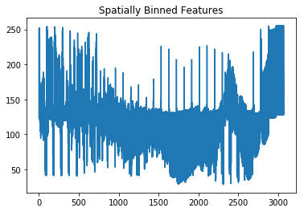
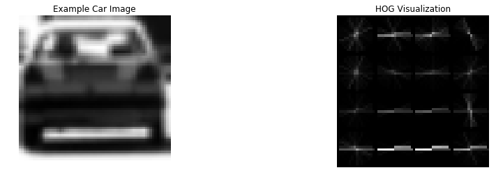
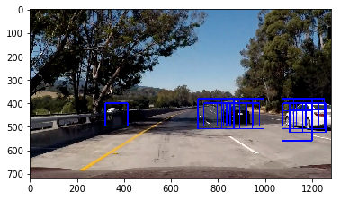
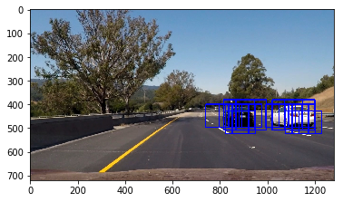
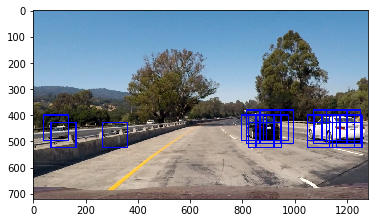

# Self Driving Car Engineer Nano degree

## Deep Learning

## Project: Vehicle Detection and Classification

The goals / steps of this project are the following:

* Perform a Histogram of Oriented Gradients (HOG) feature extraction on a labeled training set of images and train a classifier Linear SVM classifier
* Optionally, you can also apply a color transform and append binned color features, as well as histograms of color, to your HOG feature vector.
* Note: for those first two steps don't forget to normalize your features and randomize a selection for training and testing.
* Implement a sliding-window technique and use your trained classifier to search for vehicles in images.
* Run your pipeline on a video stream (start with the test_video.mp4 and later implement on full project_video.mp4) and create a heat map of recurring detections frame by frame to reject outliers and follow detected vehicles.
* Estimate a bounding box for vehicles detected.

## [Rubric](https://review.udacity.com/#!/rubrics/513/view) Points
### Here I will consider the rubric points individually and describe how I addressed each point in my implementation.  

---

### Writeup / README

#### 1. Provide a Writeup / README that includes all the rubric points and how you addressed each one.  You can submit your writeup as markdown or pdf.  [Here](https://github.com/udacity/CarND-Vehicle-Detection/blob/master/writeup_template.md) is a template writeup for this project you can use as a guide and a starting point.  

You're reading it!

### Histogram of Oriented Gradients (HOG)

#### 1. Explain how (and identify where in your code) you extracted HOG features from the training images.

The code for this step(`get_hog_features(img, orient, pix_per_cell, cell_per_block, vis, feature_vec)`) is contained in the `#[9]` code cell of the Jupyter notebook. And from `#[1]` to `#[13]` code cell is for extract different feature set(color feature, spatial feature, hog feature) and use this feature to train a classifier with SVM.

I started by reading in all the vehicle and non-vehicle images. Here is an example of one of each of the vehicle and non-vehicle classes:


Color histogram for the sample car is displayed below. The `np.histogram(img[:,:,0], bins=nbins, range=bins_range)` code for color histogram, I used `bins=32` and the `range=(0, 256)` for computing the histogram.


Spatially-Binned features for the random car using the 'YCrCb' color space is as follows:



I then explored different color spaces `skimage.feature.hog(img, orientations, pixels_per_cell, cells_per_block, transform_sqrt, visualise, feature_vector)` parameters. Based on multiple trials, I choose the following parameters for HOG:

``` python
# Define HOG parameters
orient = 32
pix_per_cell = (16, 16)
cell_per_block = (2, 2)
transform_sqrt = False
visualise = False
feature_vector = True
```

Here is the HOG features using the `YCrCb` color space and the above HOG parameters:





#### 2. Explain how you settled on your final choice of HOG parameters.

I have tried various combinations of parameters and numerous experiments for feature extraction. Combination of following feature produced a better model accuracy:  

* using all channels of 'YCrCb' color space,
* spatial binning,
* color histogram,
* using all hog channels

For the color space, using all channels helps the model because the model receives more information.

After trying smaller orientations and different pixles per cells, I finally decided to use (32, 32) orientations and (16, 16) pixles per cel to feed more information to the model.

And cells per block was kept constant as (2, 2) during different experiments.

For spacial binning, I tried 8, 12, 16 and 32 bins. Higher number of bins can get better model accuracy.


#### 3. Describe how (and identify where in your code) you trained a classifier using your selected HOG features (and color features if you used them).

The function `extract_features` implemented in cell `#[11]` of the Jupyter notebook uses the combination of spatial binning, color histogram and hog features to generate the full feature set for the image.

Before use training data to train a classifier, I use `#[13]` to nomalize the feature.

Then I choose SVM as my classifier because it provides a good combination of speed and accuracy. The SVM is trained in cell `#14` of the code. extracted features are mapped to their corresponding labels for the training data set.

The trained SVM model achieved the accuracy of 0.9901 for the testing data.


```
13.55 Seconds to train SVC...
Test Accuracy of SVC =  0.9901
My SVC predicts:      [ 0.  0.  1.  0.  1.  0.  0.  1.  0.  1.]
For these 10 labels:  [ 0.  0.  1.  0.  1.  0.  0.  1.  0.  1.]
0.00127 Seconds to predict 10 labels with SVC
 ```


### Sliding Window Search

#### 1. Describe how (and identify where in your code) you implemented a sliding window search.  How did you decide what scales to search and how much to overlap windows?

I implemented the code for Sliding Window Search with code cells from `#15` to `#18`.

* `#15`: `draw_boxes()` will drawing the bounding boxes on the image
* `#16`: `slide_window()` will take one frame of image, with start and stop position, and windows size, then return a list of window(actually rectangle area) which need to be calculated feature on it
* `#17`: `single_img_features()` will take one window, and calculate the feature of this window
* `#18`: `search_windows()` will receive a image and a list of windows (output of slide_windows()) to be searched then return windows for positive detection.

And I choose 3 different size of scales to search, the start and stop position and window sizes and the window overlap ratio as below:

```python
y_start_stop = [None, None] # Min and max in y to search in slide_window()

# define a function to run through all 3 types of windows
window_x_limits = [[None, None],
                   [40, None],
                   [400, 1280]]

window_y_limits = [[380, 640],
                   [400, 600],
                   [440, 560]]

window_size_src = [(128, 128),
                   (96, 96),
                   (64, 64)]

window_overlap = [(0.6, 0.6),
                  (0.7, 0.7),
                  (0.8, 0.8)]
```

The sliding window function searches for the cars within the specified regions using the corresponding window size and overlaps.


#### 2. Show some examples of test images to demonstrate how your pipeline is working.  What did you do to optimize the performance of your classifier?

The result images for demonstration:











##### Classifier performance Optimizing

I have tried different hyper parameter of SVC and different combination to extract the features from image, like how many channel I should use and the pixel_per_cell etc. Increase the channel number can increase the final accuracy, but also will increase the calculation time. And also increase pixel_per_cell will speed up the execution. After many experiments, when I choose all channel and pixels_per_cell=16, I got a pretty fast prediction: 0.00127 Seconds to predict 10 labels with SVC.

Apart from above method, fine tune the overlap ratio and window size also can help to improve the performance.


### Video Implementation

#### 1. Provide a link to your final video output.  Your pipeline should perform reasonably well on the entire project video (somewhat wobbly or unstable bounding boxes are ok as long as you are identifying the vehicles most of the time with minimal false positives.)

Here's a [link to my video result](./vehicle_detected.mp4)


<video width="960" height="540" controls>
  <source src="vehicle_detected.mp4">
</video>


#### 2. Describe how (and identify where in your code) you implemented some kind of filter for false positives and some method for combining overlapping bounding boxes.

The code cell I used to filter false positives and method for combining overlapping bounding boxes is `#22` and `#23`.

I recorded the positions of positive detections in each frame of the video.  From the positive detections I created a heatmap and then thresholded(I use `threashold=1`) that map to identify vehicle positions. The heatmaps are tracked over 10 frames. I then used `scipy.ndimage.measurements.label()` to identify individual blobs in the heatmap. Then I assumed each blob corresponded to a vehicle. Finally I constructed bounding boxes to cover the area of each blob detected.

I have try to use `threadhold=2`, but for the last test image below, it will false to track the vehicle. So finally I use `threadhold=1`.

Here are the result showing the heatmap from a series of frames of video:


---

### Discussion

#### 1. Briefly discuss any problems / issues you faced in your implementation of this project.  Where will your pipeline likely fail?  What could you do to make it more robust?

There are still some false positives in the model. I think if we use more training data, it will help the model to perform better. And fine tune the feature extraction can also can be helpful.

Apart from above, the model is performs relatively slow which can be a challenge for real-time implementation. I think the new deep learning based YOLO model would be a good next step experiments.

Oncoming vehicles is sometime picked up by the model. This can be improved by narrowing the search window to the area in front of the car.
